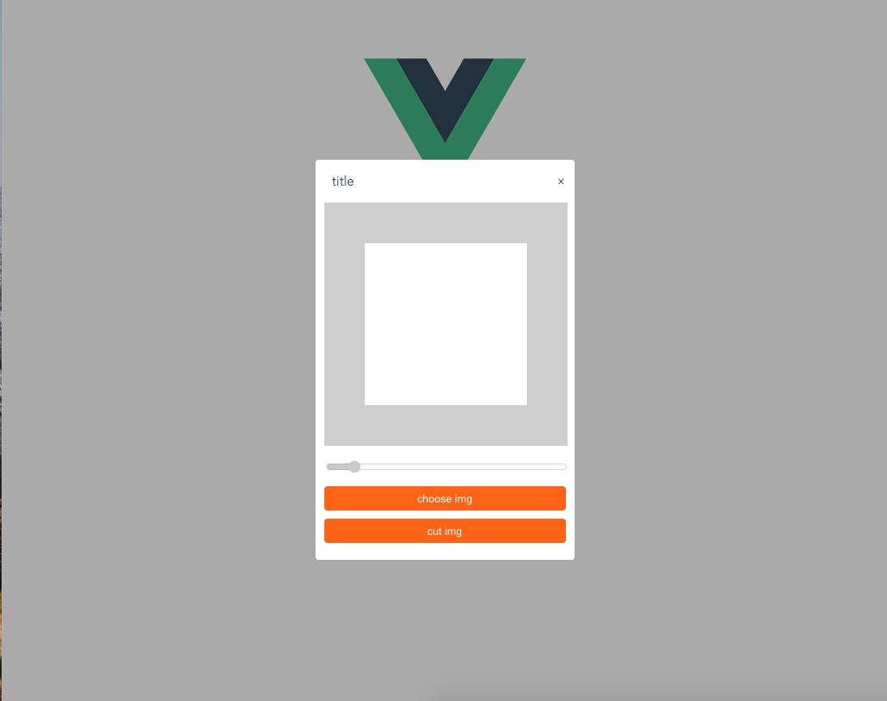
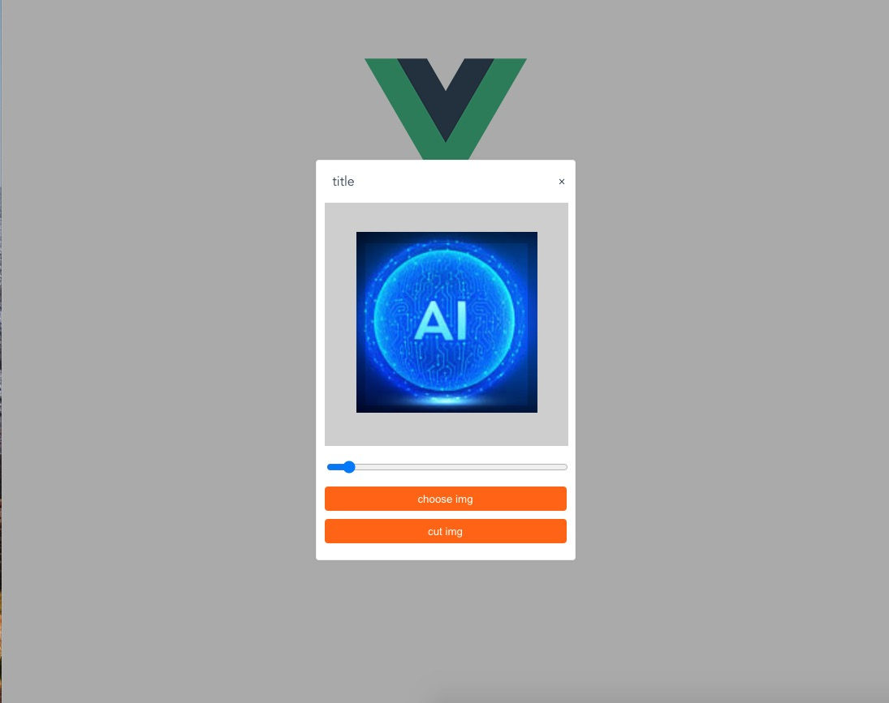

# vue-cut-img

**支持vue2.x vue3.x的图标裁剪工具**

## 快速开始

+ 首先安装组件
    + **yarn**
    + `yarn add @fuyoo/vue-cut-img`

    + **npm**
    + `npm i @fuyoo/vue-cut-img -S`

+ 然后安装组件

    + **vue2 使用**
    + ```js
        import Vue from 'vue'
        import VueCutImg from '@fuyoo/vue-cut-img'
        import "@fuyoo/vue-cut-img/lib/vue-cut-img.css"
        Vue.use(VueCutImg)
        ```

    + **vue3 使用**
    + ```js
        import { createApp } from 'vue'
        import { createApp } from 'vue'
        import App from './App.vue'
        import VueCutImg from '@fuyoo/vue-cut-img'
        import "@fuyoo/vue-cut-img/lib/vue-cut-img.css"
        createApp(App).use(VueCutImg).mount('#app')
        ```

## 属性

|  属性   | 描述  |
|  ----  | ----  |
| :blob  | {bool} 结果返回base64还是blob |
| :title  | {string} 标题名称 |
| :choose-btn  | {string} 选择图片按钮标题 |
| :cut-btn  | {string} 裁剪按钮标题 |
| :show-close  | {bool} 是否显示关闭按钮，默认true |

## 事件

|  事件   | 描述  |
|  ----  | ----  |
| @data  | 裁剪按钮点击过后触发的事件 |
| @close  | 关闭按钮点击过后触发的事件 |
| @error  | 选择的文件不是图片的时候触发的事件，返回选择的文件 |

### 例子

```html
<template>
    <div>
        <vue-cut-img 
        :title="`title`" 
        :close-show="true" 
        :choose-btn="`choose img`"
        :cut-btn="`cut img`"
        @close="closeFn" 
        :blob="true" @data="getDataFn"></vue-cut-img>
    </div> 
</template>    

<script>
import VueCutImg from '@fuyoo/vue-cut-img'
export default {
    name:"demo",
    components:{VueCutImg},
    data(){
        return {isBlob:false}
    }
    methods:{
        /**
         * 如果 this.isBlob === true
         * @data {blob:Blob,file:File} 返回裁剪后的blob对象和原始文件对象
         * 如果 this.isBlob  === false
         * @data {String} base64字符串
         */
        getDataFn(data){
            console.log(data)
        },
        /**
         * 组件关闭事件触发
         */
        closeFn(){

        }
    }
}
</script>
```
## 预览

**初始化**



**图片操作**



## 开源协议

MIT